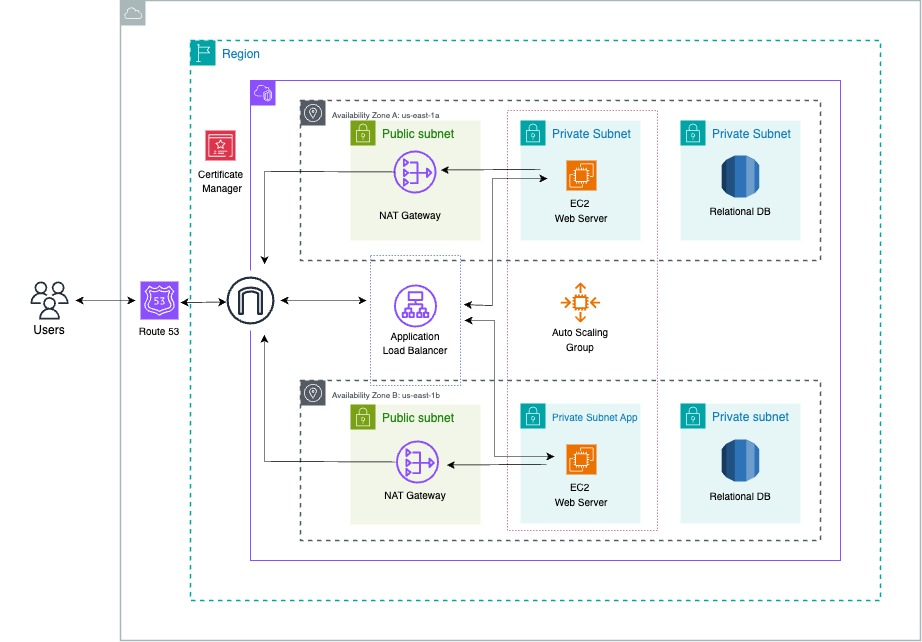

---

# Project Overview
This hands-on demonstrates the deployment of a static HTML web application on the AWS console using various services and resources. The setup includes a Custom VPC with public and private subnets spread across multiple availability zones for high availability and fault tolerance. It utilizes an Application Load Balancer to distribute web traffic across EC2 instances hosted in the public subnets, providing scalability and elasticity through an Auto Scaling Group. Security is enforced using Security Groups and a Bastion Host, while NAT Gateway facilitates internet access for instances in private subnets

# Project Resources
**Custom VPC** with public and private subnets in 2 availability zones.
**Internet Gateway** for communication between VPC instances and the internet.
**Security Groups** for firewall configuration.
**2 Availability Zones** for high availability and fault tolerance.
**NAT Gateway** for private subnet internet access.
**Bastion Host** for secure access to private resources.
**EC2 Instance Connect Endpoint** for resource connectivity.
**EC2 Instance**s hosting the static website.
**Application Load Balancer** to distribute web traffic.
**Auto Scaling Group** for dynamic EC2 instance management.
**Route 53** for domain registration and DNS management.

# Deployment Script For The Project
Below is the bash script used to deploy the web app on an EC2 instance:

```bash
#!/bin/bash
sudo su
yum update -y
yum install -y httpd
cd /var/www/html
wget https://github.com/bojide/jupiter-site/raw/main/jupiter.zip 
unzip jupiter.zip
cp -r /var/www/html/jupiter-site/* /var/www/html
rm -rf jupiter.zip jupiter-main
systemctl enable httpd
systemctl start httpd
```

# Deployment Steps
1. **Setting Up Infrastructure**
- Create a Custom VPC with public and private subnets across 2 availability zones.
- Attach an Internet Gateway to the VPC.
- Configure Security Groups to control inbound and outbound traffic.
- Deploy NAT Gateway for private subnet internet access.
- Implement a Bastion Host for secure access to private resources.

2. **EC2 Instance Configuration**
- Launch EC2 Instances in the public subnets to host the website.
- Configure EC2 Instance Connect Endpoint for connectivity.
- Install Apache HTTP Server (httpd) on EC2 instances.

3. **Load Balancing and Auto Scaling**
- Set up an Application Load Balancer to distribute web traffic across EC2 instances.
- Create an Auto Scaling Group to ensure high availability, scalability, fault tolerance, and elasticity of the website.

4. **Domain Registration and DNS Configuration**
- Register a domain name using Route 53.
- Configure DNS settings to point to the Application Load Balancer.
